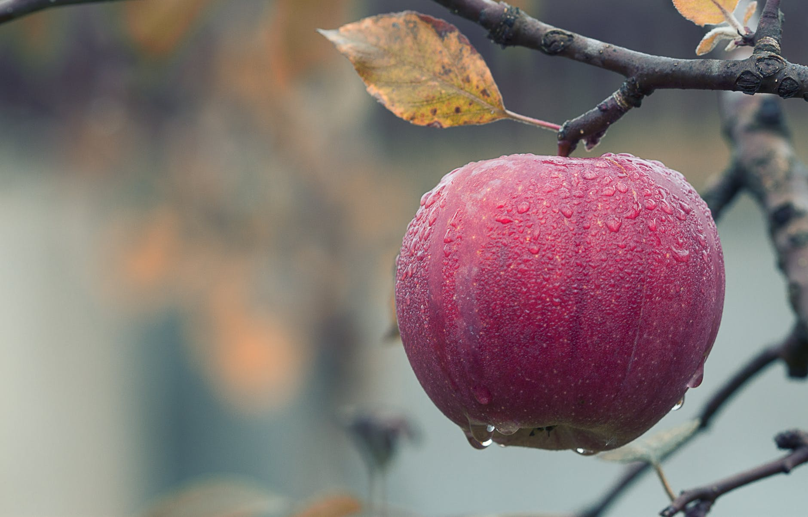

# AES Encryption with LSB Steganography and PSNR Calculation

This project implements AES (Advanced Encryption Standard) encryption combined with LSB (Least Significant Bit) steganography to securely hide messages within images. It also includes a PSNR (Peak Signal-to-Noise Ratio) calculation to evaluate the quality of the steganography.

## Table of Contents

- [AES Encryption with LSB Steganography and PSNR Calculation](#aes-encryption-with-lsb-steganography-and-psnr-calculation)
  - [Table of Contents](#table-of-contents)
  - [Overview](#overview)
  - [Features](#features)
  - [Requirements](#requirements)
  - [Installation](#installation)
  - [Usage](#usage)
  - [Process Explanation](#process-explanation)
    - [Encryption and Embedding](#encryption-and-embedding)
  - [Sample Images](#sample-images)
    - [Original Images](#original-images)
    - [Encrypted Output](#encrypted-output)
    - [PSNR](#psnr)
  - [PSNR Calculation](#psnr-calculation)
  - [Contributing](#contributing)

## Overview

This project combines cryptography and steganography to provide a secure method of hiding messages within images. It uses AES encryption to secure the message and LSB steganography to embed the encrypted message into an image file. The quality of the steganography is then evaluated using PSNR.

## Features

- AES encryption for message security
- LSB steganography for hiding encrypted messages in images
- PSNR calculation to evaluate steganography quality
- Support for PNG image format

## Requirements

- Python 3.x
- Required Python libraries:
  - stegano
  - cryptography
  - numpy
  - scipy
  - opencv-python (cv2)

## Installation

1. Clone this repository:
   ```
   git clone https://github.com/masud1901/AES-encription-with-LSB-steganography.git
   ```

2. Install the required libraries:
   ```
   pip install stegano cryptography numpy scipy opencv-python
   ```

## Usage

1. Encoding a message:
   ```python
   python encode_.py
   ```
   This will use the input image from `./Images/Penguin.png`, encode the secret message, and save the result to `./output/encrypted.png`.

2. Decoding a message:
   Run the decoding script:
   ```python
   python decode_.py
   ```
   This will decode the message and print it on the terminal

3. Calculating PSNR:
   ```python
   python PNSR.py
   ```
   This will compare the original image with the encrypted image and output the PSNR value.

## Process Explanation

### Encryption and Embedding

1. **Key Generation**: A secure 32-byte key is generated and saved to `key.bin`.

2. **Message Encryption**:
   - An initialization vector (IV) is randomly generated.
   - The message is padded using PKCS7 padding.
   - The padded message is encrypted using AES in CBC mode.

3. **Steganography**:
   - The IV and ciphertext are combined.
   - The encrypted message is converted to hexadecimal.
   - LSB steganography is used to hide the encrypted message in the image.

4. **Output**: The resulting image with the hidden message is saved as a PNG file.

## Sample Images

### Original Images

Here are some of the original images used for steganography:

<div style="text-align: center;">
  

</div>

### Encrypted Output

Below is an example of an encrypted image after applying AES encryption and LSB steganography:

<div style="text-align: center;">
  
</div>

Note: The differences between the original and encrypted images are not visually perceptible, demonstrating the effectiveness of the LSB steganography technique.

### PSNR

1. The original and stego images are loaded.
2. Images are padded to ensure compatible dimensions.
3. Mean Square Error (MSE) is calculated between the images.
4. PSNR is calculated using the MSE value.

## PSNR Calculation

PSNR (Peak Signal-to-Noise Ratio) is used to measure the quality of the steganography. A higher PSNR value indicates that the stego image is more similar to the original image, suggesting better steganography.

The PSNR is calculated using the formula:

```
PSNR = 20 * log10(MAX_PIXEL_VALUE / sqrt(MSE))
```

where MSE is the Mean Square Error between the original and stego images.

The project includes a `Compare` class that provides methods for:

- Calculating correlation between images
- Computing Mean Square Error
- Calculating PSNR
- Adding padding to images for comparison

## Contributing

Contributions to this project are welcome. Please fork the repository and submit a pull request with your changes.
